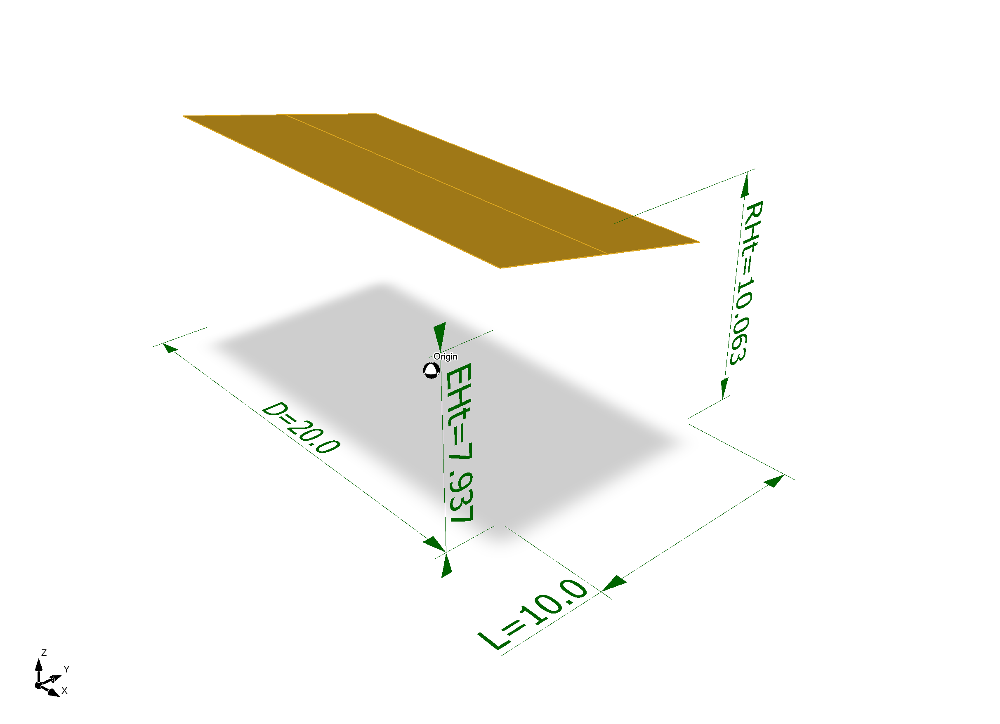
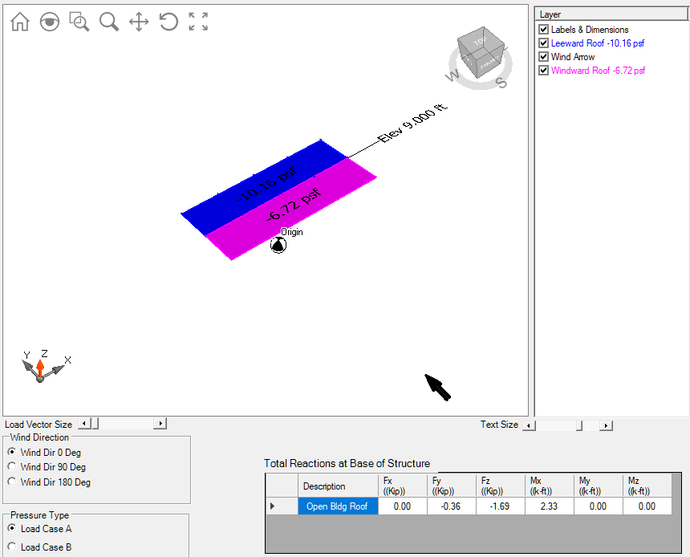

#  Solar Canopy

This report covers the structural design of a residential solar canopy
located in the City of Larkspur, California. It includes the design of a        
concrete slab and stem wall, a steel tube frame, and attachments of solar       
panels to the frame. The report contents include::

                [01] Loads
                    [01] Gravity
                    [02] Wind and Seismic
                [02] Frame
                    [01] Steel tubes
                    [02] Connections and clips
                [03] Foundation
                    [01] Slab
                    [02] Stem wall
                [04] References and Abbreviations
                    [01] Codes and Standards
                    [02] Abbreviations
                    [03] Symbols

 .. Project Data - not included here, see report output

## [0101-01]   Governing Codes

 
[01] Fig. 01 - Wind load 1

------

 
[01] Fig. 02 - Wind load 1

------

Building Codes and Jurisdiction
- City of Larkspur, California
- 2019 California Building Code [CBC]
- 2019 California Residential Code [CRC]

The canopy is designed for compliance with the requirements of the CBC.

### Table 01 - Table of Standards                                           01 - T01

Basic loads and load combinations are derived from the California Building      
and Residential Codes.

Table 02 - Table of Load Types                                          01 - T02

Table 03 - Table of Load Combinations                                   01 - T03

##  Solar Canopy 2

some text
